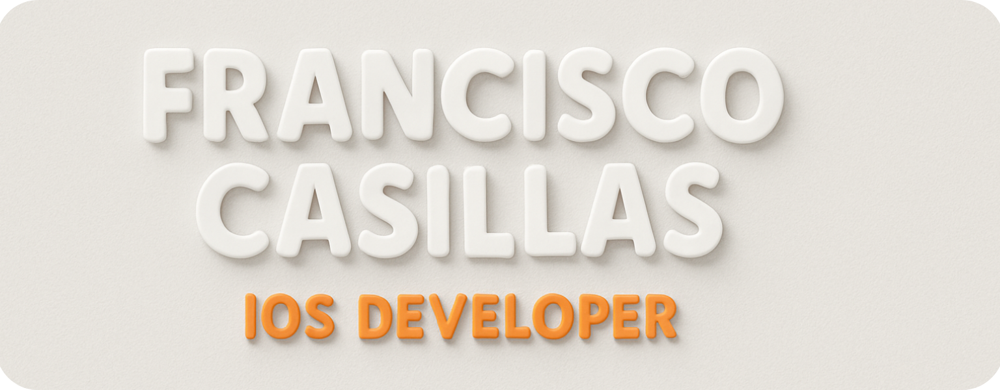
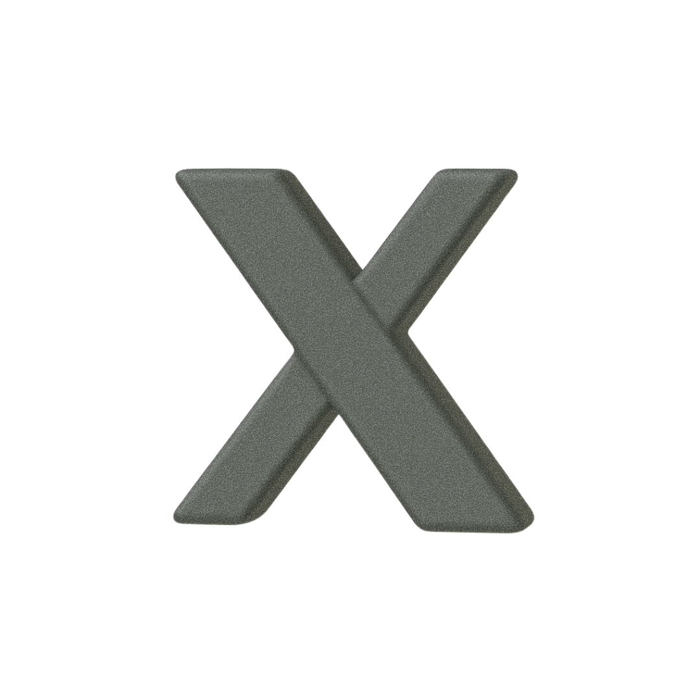
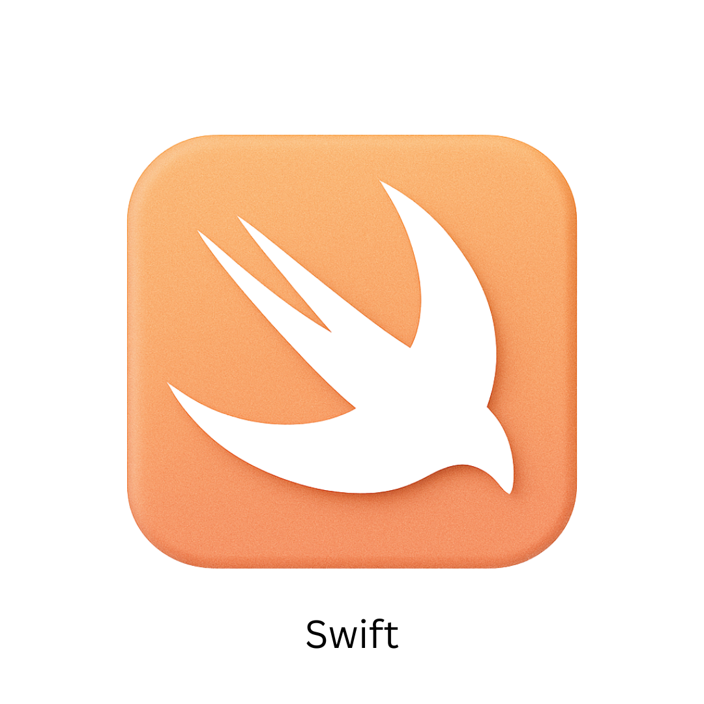
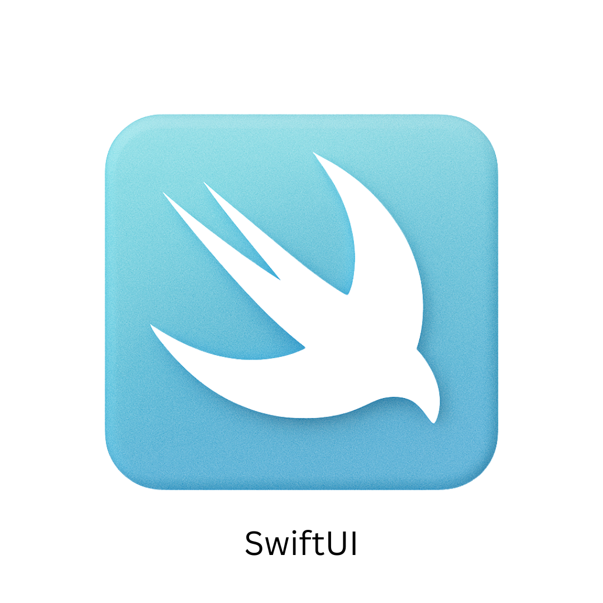
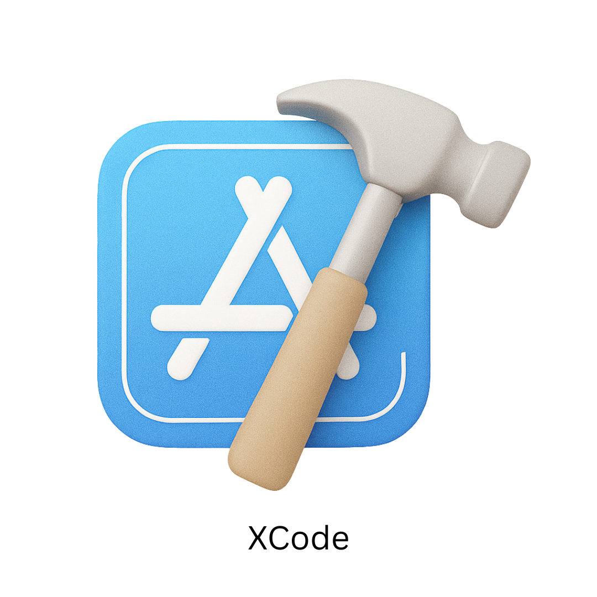
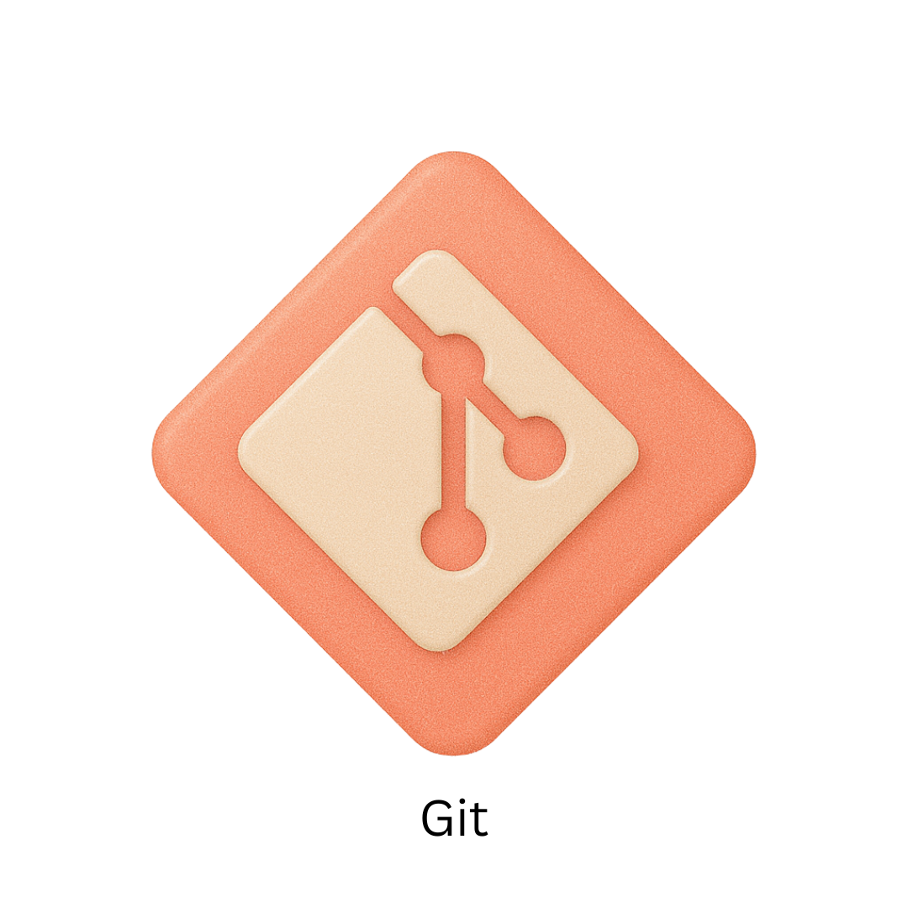
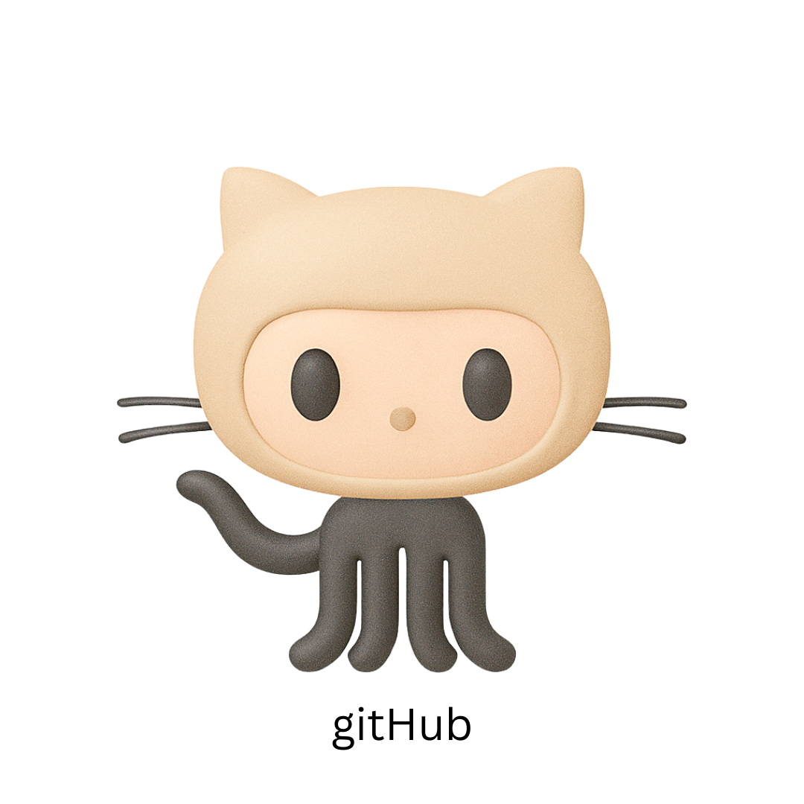

&nbsp;&nbsp;&nbsp;&nbsp;

I'm an iOS developer with a background in Audiovisual Communication, currently studying Computer Systems Engineering. I enjoy building thoughtful, well-designed apps and exploring the intersection between technology and creativity. I'm actively looking for an internship to grow as a developer and contribute to a great team.

---

<h1 align="center">Tech Stack</h1>

  
  
  
  
  

